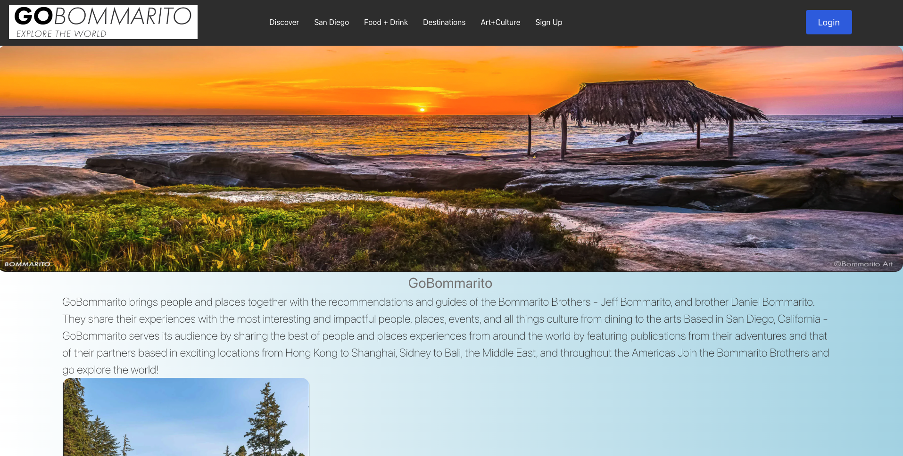

 

# GoBommarito
 

## Description
Fullstack MERN application for professional photographer & business brother duo sharing their curated favorites across the globe. This is the first itieration of a blog developed as a final project for UC Berkeley Extensions fullstack development bootcamp.
GoBommarito is a full-stack web application that allows users to view blogs and create their own blogs. Users can also create an account and login to view their own blogs. The application is built with React, Node.js, Express, MongoDB, and Tailwind CSS. The application is deployed on Heroku and MongoDB Atlas.
 

## Table of Contents
* [Installation](#installation)
* [Usage](#usage)
* [Contributing](#contributing)
* [Tests](#tests)
* [Questions](#questions)
 

#Learning Moments
Connecting Backend to Frontend was a challenge that our team overcame by using the MERN stack. We also learned how to use Tailwind CSS to style our application. We also learned how to use MongoDB Atlas to deploy our database to the cloud.
Also learned how to use Heroku to deploy our application to the cloud.
And also learned how to use React Router to allow users to navigate through our application.
 

#Future Development
Future payment integration to allow users to purchase prints of their favorite photos.
Grid FS to allow users to upload photos to their blogs.
And also a way to view all blogs by a specific user.

## Installation
To install necessary dependencies, run the following command:
`npm i`
`npm install -D @tailwindcss/forms`
 

#Build with
* React
* Node.js
* Express
* MongoDB
* Tailwind CSS
* Heroku
* MongoDB Atlas
 

## Usage
Visit the deployed Heroku link here.

https://boiling-shelf-38038.herokuapp.com/

 
Alternatively, install dependencies and run on your local machine with `npm run develop`.

## License
This is a project under the MIT license.
 

## Contributing
Max Sciuclin, Malia Yraguen, John Leamy, and Karinne Sagir.
 

## Tests
To run tests, run the following commands
`npm test`.
 

## Questions
If you have any questions about the repo or project, please contact one of the contributors such as Malia at maliayraguen@gmail.com, Karinne at karinne.sagir@gmail.com or Max at maxambraci@gmail.com.

# Contributing
  - Malia Yraguen
  - John Leamy
  - Max Sciuclin
  - Karinne Sagir

## Atlas DB deployment notes
  1. create the collection
  2. name it the same as local
  3. Replace teh mongodb uri value in the env
  5. whitelist all the IP ranges (button to click - allow from anywhere - it will add 0.0.0.0/0 range)
  6. seed everything using the seed file
  7. deploy to heroku - in heroku, set the same variable as the mongoDB uri

  - link blogs to profiles
  

